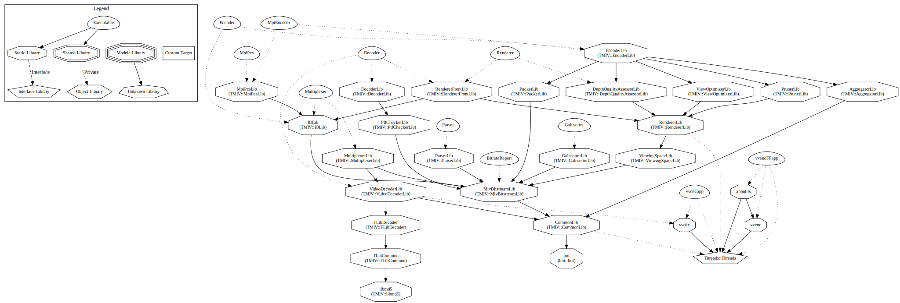

# MIV reference software

## Introduction

A general overview of ISO/IEC 23090-12 MPEG immersive video (MIV) is available at http://mpeg-miv.org, including [a list of relevant MPEG documents](https://mpeg-miv.org/index.php/mpeg-documents/).

This software project provides:

* an embodiment of the *Test Model of MPEG immersive video* (TMIV)
* a ISO/IEC 23090-12 *MPEG immersive video* (MIV) codec
* the reference software encoder and decoder of ISO/IEC 23090-23 *Conformance and reference software for MPEG immersive video*.

## Build and installation instructions

TMIV is a C++17 CMake project with prebuild script for its dependencies. For further build and installation instructions, see [doc/building.md](doc/building.md)

## Instructions to run TMIV

TMIV can be run in various CTC and non-CTC conditions, with various underlying 2D video codecs.
For details, see [doc/running.md](/doc/running.md).

## Configuring TMIV

TMIV's executables can be configured through configuration files and command line parameters.
For details, see [doc/configuring.md](/doc/configuring.md).

## Instruction to use TMIV as a library

In the `CMakeLists.txt` of the larger project, use a line like:

```CMake
find_package(TMIV)
```

The `TMIV_DIR` variable needs to be set to the directory named `/Workspace/tmiv_install/lib/cmake/TMIV` or `/Workspace/tmiv_install/lib64/cmake/TMIV` depending on the platform. 

After that the targets `DecoderLib`, `TMIV::DecoderLib`, `EncoderLib`, `TMIV::EncoderLib`, etc. are available as target dependencies.

## Structure of the reference software

This software consists of multiple executables and static libraries. Below figure is the CMake module dependency graph. The most important executables are Encoder and Decoder. When enabled, the project also includes the HM executables TAppEncoder and TAppDecoder.



Each module consists of one or more components. Most components derive from an interface and some interfaces have multiple alternative components. For instance, the ViewOptimizerLib includes an IViewOptimizer interface with NoViewOptimizer and ViewReducer components that implement that interface.

## Contributing to the reference software

Core experiments are expected to include the reference software as a subproject
and introduce new components. Alternatively core experiments may branch the test
model. Contributions should be in the form of git merge requests to the
MPEG-internal repository. See [doc/contributing.md](doc/contributing.md) for further info.
